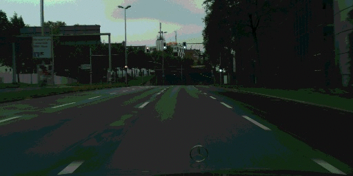
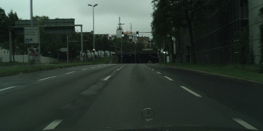
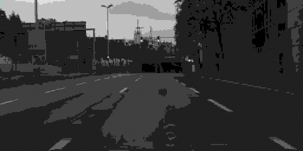
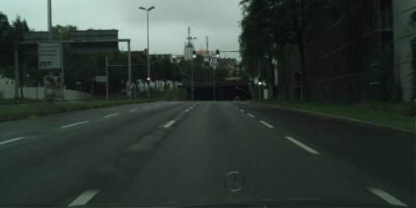

# WIP: Implementation of Google's Auto-Augmentation based on TF2 OPS

Exemplary implementation for learning augmentation policies from your training data distribution. The augmentation operations 
rely solely on tf operations which allows scalability and high computational throughput even on large images. Hence, they
can be used easily with the tf.data API.


### Example for an augmentation policy
```python
augmentation_policy = {'sub_policy0': {'op0': ['adjust_saturation', 0.2, 2],
                                       'op1': ['equalize', 0.1, 6],
                                       'op2': ['add_noise', 0.9, 6]},
                       'sub_policy1': {'op0': ['adjust_contrast', 0.1, 7],
                                       'op1': ['add_noise', 0.0, 10]},
                       'sub_policy2': {'op0': ['posterize', 0.9, 6],
                                       'op1': ['unbiased_gamma_sampling', 0.5, 1]},
                       'sub_policy3': {'op0': ['adjust_brightness', 0.3, 1],
                                       'op1': ['adjust_hue', 0.4, 5]},
                       'sub_policy4': {'op0': ['adjust_saturation', 0.2, 9],
                                       'op1': ['add_noise', 0.1, 0]},
                       'sub_policy5': {'op0': ['adjust_contrast', 1.0, 1],
                                       'op1': ['unbiased_gamma_sampling', 0.4, 9]},
                       'sub_policy6': {'op0': ['unbiased_gamma_sampling', 0.3, 0],
                                       'op1': ['adjust_hue', 0.1, 6]},
                       'sub_policy7': {'op0': ['solarize', 0.6, 0],
                                       'op1': ['adjust_gamma', 0.3, 6]},
                       'sub_policy8': {'op0': ['adjust_jpeg_quality', 0.7, 10],
                                       'op1': ['adjust_hue', 0.1, 2]},
                       'sub_policy9': {'op0': ['equalize', 0.6, 0],
                                       'op1': ['solarize', 0.0, 6]}}
```
Similar to Google Autoaugment, the augmentation policy consists of several subpolicies, which in turn consists of 
augmentation operations. Each operation is defined as a tuple of **augmentation method**, 
**probability** and **intensity**. Several operations within one subpolicy are applied in sequence. 
The augmentation policy from above would result in the following:
 


### Augmentation Methods
A list of all implemented augmentation techniques is given here. Additional, methods will be implemented in the near 
future.

| Augmentation   |      Image      |
|----------|:-------------:|
| Additive Gaussian Noise |  |
| Adjust Brightness |  |
| Adjust Contrast |  |
| Adjust Gamma |  |
| Adjust Hue |  |
| Adjust JPEG Quality |  |
| Adjust Saturation |  |
| Histogramm Equalization |  |
| Invert |  |
| Posterize |  |
| Solarize |  |
| Unbiased Gamma Sampling |  |
| Gaussian Blur |  |
| Sharpen |  |


### TODO
- [ ] Implement more Augmentation Methods
- [ ] Implement augmentation policy search with Ray Tune
- [ ] Clean up Code (Unified Docstrings)
- [ ] Benchmark augmentation methods
 

